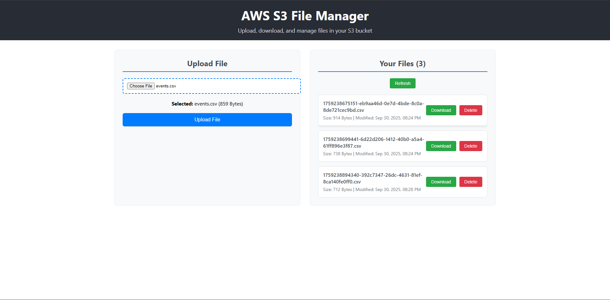

# AWS S3 File Manager


A Node.js application with client and backend for uploading and downloading files from Amazon S3.

## Features

- Upload files to AWS S3 bucket
- Download files from AWS S3 bucket
- REST API backend with Express.js
- Client-side interface for file management
- Secure file handling with AWS SDK

## Prerequisites

- Node.js (v14 or higher)
- AWS Account with S3 access
- AWS CLI configured or environment variables set

## Setup

### 1. Install Dependencies

```bash
npm run install-all
```

### 2. Environment Configuration

Create a `.env` file in the `server/` directory with the following variables:

```env
# AWS Configuration
AWS_ACCESS_KEY_ID=your_access_key_here
AWS_SECRET_ACCESS_KEY=your_secret_key_here
AWS_REGION=us-east-1
S3_BUCKET_NAME=your-bucket-name

# Server Configuration
PORT=5001
NODE_ENV=development
```

### 3. AWS S3 Bucket Setup

1. Create an S3 bucket in your AWS console
2. Configure bucket permissions for file upload/download
3. Update the bucket name in your `.env` file

## Running the Application

### Development Mode (Both client and server)
```bash
npm run dev
```

### Server Only
```bash
npm run server
```

### Client Only
```bash
npm run client
```

### Production
```bash
npm start
```

### Install Dependencies
```bash
# Install all dependencies (client + server)
npm run install-all

# Install server dependencies only
npm run install-server

# Install client dependencies only
npm run install-client
```

## API Endpoints

### Upload File
- **POST** `/api/upload`
- **Body**: multipart/form-data with file
- **Response**: File URL and metadata

### Download File
- **GET** `/api/download/:filename`
- **Response**: File stream

### List Files
- **GET** `/api/files`
- **Response**: Array of file objects

### Delete File
- **DELETE** `/api/delete/:filename`
- **Response**: Success message

## Project Structure

```
s3website/
├── server/                 # Backend Express server
│   ├── config/            # AWS configuration
│   ├── middleware/        # Multer upload middleware
│   ├── routes/            # API routes
│   ├── index.js           # Main server file
│   ├── .env               # Environment variables
│   ├── .env.example       # Environment template
│   └── package.json       # Server dependencies
├── client/                 # React frontend
│   ├── public/
│   ├── src/
│   └── package.json       # Client dependencies
├── test_upload_example/    # Test CSV files
├── package.json           # Workspace configuration
└── README.md             # This file
```

## Environment Variables

| Variable | Description | Required |
|----------|-------------|----------|
| AWS_ACCESS_KEY_ID | AWS Access Key | Yes |
| AWS_SECRET_ACCESS_KEY | AWS Secret Key | Yes |
| AWS_REGION | AWS Region | Yes |
| S3_BUCKET_NAME | S3 Bucket Name | Yes |
| PORT | Server Port | No (default: 5000) |

## Contributing

1. Fork the repository
2. Create a feature branch
3. Commit your changes
4. Push to the branch
5. Create a Pull Request

## License

This project is licensed under the MIT License.